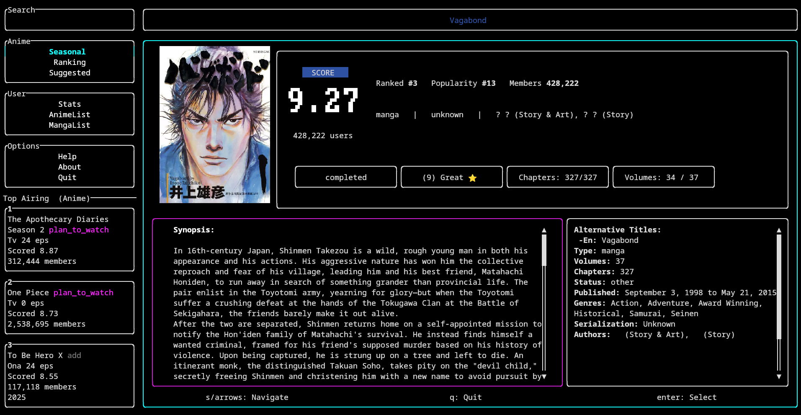

# MAL-Cli

A terminal interface for the official [myanimelist](https://myanimelist.net/) api written in rust.

forked from [SaeedAnas/mal-cli](https://github.com/SaeedAnas/mal-cli)

# HOW IT LOOKS
## Detail page

## Home page

## Profile page

## Search page


# INSTALLATION:
## ArchLinux:
  ```
  yay -S mal-cli
  ```

## using cargo:
  ```
  cargo install mal-cli-rs
  ```

## Debian-based:
  download the package from last release and run:
  ```
  sudo dpkg -i <installed-packege>
  ```
  release section can be found here 

## windows/ macos:
  download binaries from release section and run directly otherwise use cargo

# HOW TO GET CLIENT ID:
  visit 
  and if you get an error, go to your profile -> profile settings -> api -> create
  
  

# TODO:
- [ ] add help section
